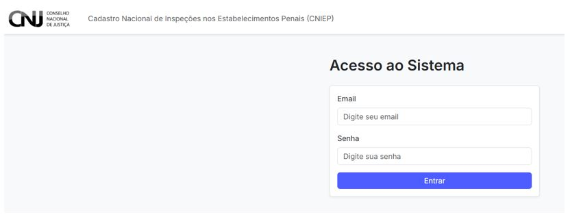
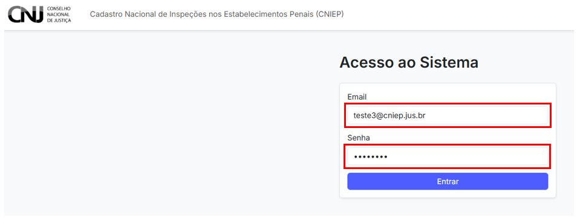

# 1. Acesso à Página Inicial do CNIEP

O acesso ao sistema CNIEP – Cadastro Nacional de Inspeções nos Estabelecimentos Penais – é realizado por meio de um ambiente web seguro, disponibilizado pelo Conselho Nacional de Justiça (CNJ).

O sistema foi desenvolvido no âmbito do programa **Pena Justa**, em parceria com a SENAPPEN e o PNUD, e está disponível para os(as) usuários(as) que atuam nas inspeções nos estabelecimentos penais.

---

## 1.1 Acessando o sistema

Para acessar o sistema, abra o navegador e digite o seguinte endereço:

```

[https://cniep2.stg.cloud.cnj.jus.br/](https://cniep2.stg.cloud.cnj.jus.br/)

```

A seguinte tela será exibida:



---

## 1.2 Inserindo credenciais

Preencha os campos com as credenciais fornecidas:

- **Email:** informe seu endereço institucional.
- **Senha:** digite sua senha de acesso.

Em seguida, clique no botão **"Entrar"**.



---

## 1.3 Observações importantes

- As credenciais serão fornecidas previamente por e-mail institucional.
- Em caso de problemas com a senha, acesse a opção de recuperação (ver seção 9).
- Por questões de segurança, **não compartilhe suas credenciais** com terceiros.

---

> 💡 **Dica:** se houver erro de autenticação, verifique se o e-mail e senha foram digitados corretamente. Utilize navegadores atualizados como Chrome ou Firefox para melhor compatibilidade.

