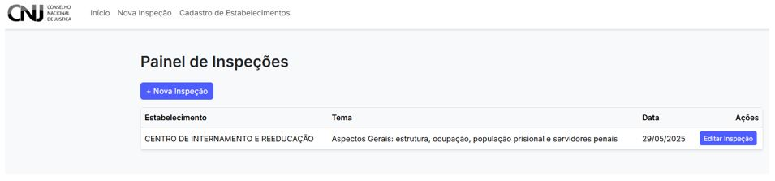
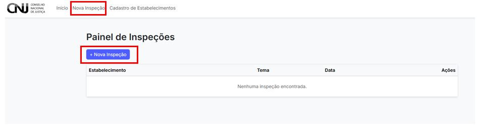

# 2. Painel de Inspeção

Após acessar o sistema, o(a) usuário(a) será direcionado ao **Painel de Inspeções**, que funciona como a tela inicial do ambiente de trabalho no CNIEP.

---

## 2.1 Visão geral do painel

O painel exibe todas as inspeções cadastradas, com os seguintes campos:

- **Estabelecimento:** nome da unidade prisional inspecionada
- **Tema:** conjunto temático da inspeção
- **Data:** data de criação ou modificação
- **Ações:** botão para edição da inspeção

Abaixo, um exemplo de painel com inspeção registrada:

---

## 2.2 Criar nova inspeção

Caso não haja inspeções cadastradas, o painel estará vazio.

Você pode iniciar uma nova inspeção clicando em:

- O botão **“+ Nova Inspeção”**, localizado acima da tabela
- Ou na aba superior **“Nova Inspeção”**

---

## 2.3 Observações

- As inspeções listadas podem ser editadas a qualquer momento, desde que não tenham sido finalizadas.
- O painel é atualizado automaticamente após a criação ou edição de uma inspeção.
- Utilize os filtros disponíveis (caso habilitados) para localizar inspeções específicas.

---

> 📌 **Dica:** mantenha o painel limpo e organizado excluindo inspeções de teste ou duplicadas, conforme diretrizes da equipe responsável.
