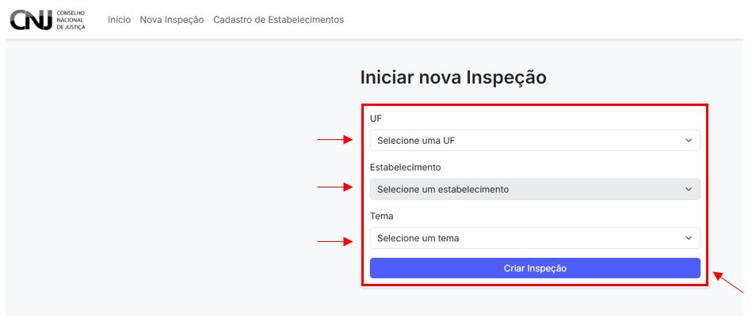

# 3. Iniciar Nova Inspeção

Para iniciar uma nova inspeção no sistema CNIEP, o(a) usuário(a) deve acessar o painel e utilizar o botão **“Nova Inspeção”**. Esta ação abrirá a tela de criação de inspeção, onde devem ser preenchidas as informações básicas para a abertura do processo.

---

## 3.1 Preenchendo os dados da inspeção

Na tela de “Iniciar nova Inspeção”, serão solicitadas três informações obrigatórias:

- **UF:** selecione a unidade federativa do estabelecimento penal.
- **Estabelecimento:** selecione a unidade específica onde a inspeção será realizada.
- **Tema:** escolha o tema da inspeção a ser aplicada, como por exemplo:
  - *Aspectos Gerais: estrutura, ocupação, população prisional e servidores penais*

Após preencher todos os campos, clique em **“Criar Inspeção”**.

---

## 3.2 Considerações importantes

- Certifique-se de selecionar corretamente as informações. Após a criação, **não será possível alterar** a UF, o estabelecimento ou o tema.
- Os temas disponíveis são definidos previamente pela equipe gestora do CNIEP.
- Caso não encontre o estabelecimento na lista, entre em contato com o administrador regional.

---

> ⚠️ **Atenção:** seleções incorretas podem gerar registros inválidos e comprometer o ciclo de inspeção. Preencha com cuidado.
