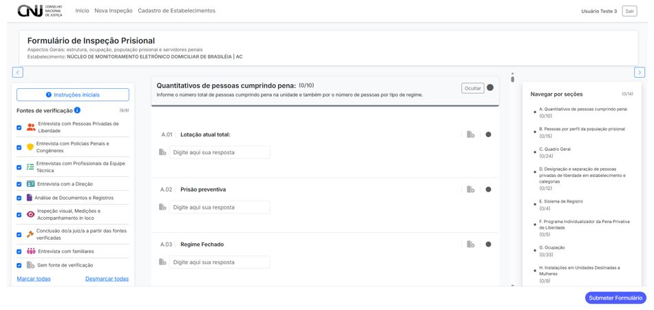
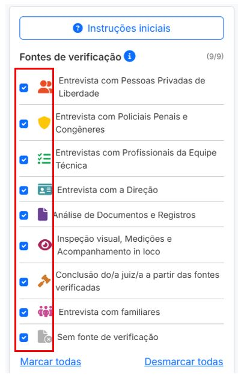

# 4.1 Fontes de Verificação

As **fontes de verificação** são os instrumentos e métodos utilizados para subsidiar o preenchimento do formulário de inspeção prisional. Elas são parte essencial da metodologia do CNIEP e devem ser selecionadas com base nas condições reais da inspeção em campo.

---

## 4.1.1 Onde encontrar as fontes

As fontes de verificação estão localizadas na **barra lateral esquerda** da interface do formulário:

---

## 4.1.2 Lista de fontes disponíveis

Abaixo está a lista de fontes que podem ser marcadas:

- 🧍‍♀️ Entrevista com Pessoas Privadas de Liberdade  
- 🛡️ Entrevista com Policiais Penais e Congêneres  
- 🧑‍⚕️ Entrevistas com Profissionais da Equipe Técnica  
- 🏢 Entrevista com a Direção  
- 📄 Análise de Documentos e Registros  
- 👁️ Inspeção visual, medições e acompanhamento in loco  
- ⚖️ Conclusão do(a) juiz(a) a partir das fontes verificadas  
- 👨‍👩‍👧‍👦 Entrevista com familiares  
- 📌 Sem fonte de verificação

O painel lateral permite **marcar todas**, **desmarcar todas**, ou selecionar individualmente conforme o contexto da unidade inspecionada.

---

## 4.1.3 Considerações metodológicas

- As fontes marcadas impactam diretamente nas questões exibidas no formulário.  
- Cada questão pode ter uma ou mais fontes associadas, e somente será exibida se houver interseção entre as fontes da questão e as fontes selecionadas.
- A opção “Sem fonte de verificação” pode ser usada para registrar observações sem base empírica ou quando não houver possibilidade de apuração direta.

---

> 🧠 **Importante:** a seleção de fontes deve refletir o planejamento da inspeção e os métodos efetivamente utilizados em campo. A rastreabilidade metodológica é fundamental para a validade dos dados.
