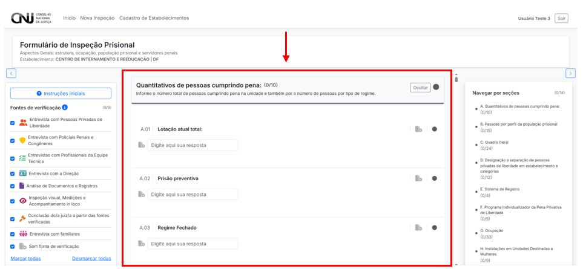

# 4.2 Questões/Perguntas do Formulário

O formulário eletrônico do CNIEP é composto por uma série de questões agrupadas por seções temáticas. Cada seção representa um eixo relevante para a inspeção prisional, e as perguntas são elaboradas com base em evidências, indicadores e padrões normativos.

---

## 4.2.1 Tipos de perguntas

As perguntas podem assumir diferentes formatos, de acordo com o tipo de informação requerida:

- **Campos numéricos:** para preenchimento de quantidades, lotações, percentuais etc.
- **Campos de texto:** para descrições, justificativas e observações livres.
- **Seleção única (radio):** para escolha de uma alternativa entre várias.
- **Seleção múltipla (checkbox):** para marcação de várias alternativas simultaneamente.
- **Campos com fontes associadas:** exigem justificativa conforme a fonte de verificação selecionada.

---

## 4.2.2 Exemplo de seção do formulário

Na imagem abaixo, temos a seção **"A. Quantitativos de pessoas cumprindo pena"**, com campos numéricos para preenchimento:

- A.01 – Lotação atual total  
- A.02 – Prisão preventiva  
- A.03 – Regime fechado  

---

## 4.2.3 Considerações sobre preenchimento

- Algumas perguntas são **obrigatórias**, e a ausência de resposta impede a submissão do formulário.
- O número total de perguntas respondidas é atualizado automaticamente no topo de cada seção.
- É possível utilizar as barras laterais para navegar entre seções e visualizar o progresso.

---

> 📌 **Dica:** utilize sempre que possível as fontes de verificação para justificar as respostas. Isso fortalece a confiabilidade da inspeção.
