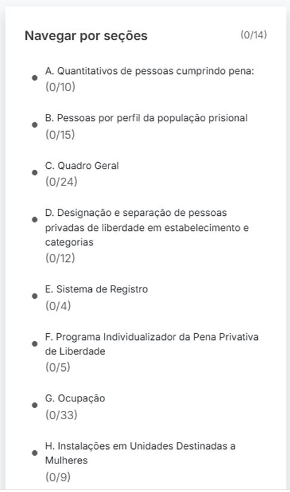

# 4.3 Navegar por Seções

O formulário de inspeção do CNIEP é organizado em **seções temáticas**, cada uma reunindo um conjunto de perguntas relacionadas a um aspecto específico da realidade prisional.

A navegação por essas seções é facilitada por um **painel lateral direito**, que permanece fixo durante todo o preenchimento.

---

## 4.3.1 Estrutura das seções

Cada seção é identificada por uma letra e um título descritivo. O painel apresenta também o número de perguntas respondidas em cada bloco.

Exemplo de seções:

- A. Quantitativos de pessoas cumprindo pena (0/10)
- B. Pessoas por perfil da população prisional (0/15)
- C. Quadro Geral (0/24)
- D. Designação e separação de pessoas privadas de liberdade (0/12)
- E. Sistema de Registro (0/4)
- F. Programa Individualizador da Pena Privativa de Liberdade (0/5)
- G. Ocupação (0/33)
- H. Instalações em Unidades Destinadas a Mulheres (0/9)

---

## 4.3.2 Funcionalidades do painel lateral

- **Indicadores de progresso:** mostram quantas perguntas foram respondidas em cada seção.
- **Acesso direto:** clique sobre o nome da seção para navegar diretamente até ela.
- **Organização lógica:** as seções seguem uma ordem alfabética, refletindo a estrutura do formulário impresso.

---

## 4.3.3 Dicas de uso

- Acompanhe seu avanço geral no formulário com base nos totais preenchidos.
- Use esse painel para revisar seções antes de submeter o formulário.
- O painel é especialmente útil em inspeções longas, com múltiplas fontes e temas.

---

> 🎯 **Importante:** você só poderá submeter o formulário após preencher as perguntas obrigatórias de todas as seções aplicáveis.
