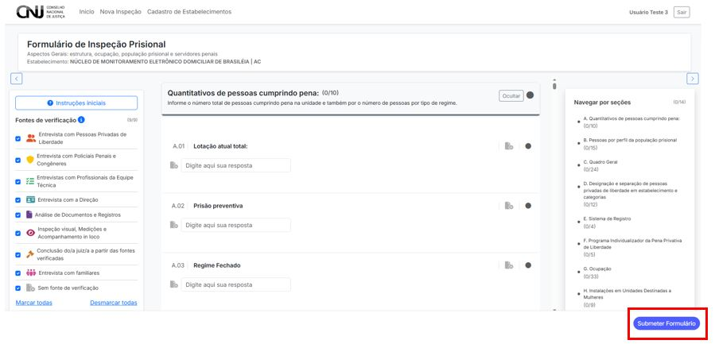

# 4.4 Submeter Formulário

Após o preenchimento das seções do formulário de inspeção, o sistema permite realizar a **submissão oficial** da inspeção. Esta é a última etapa da fase de preenchimento e deve ser executada com atenção, pois os dados serão encaminhados para a etapa de finalização.

---

## 4.4.1 Botão de submissão

O botão **"Submeter Formulário"** está localizado no canto inferior direito da tela. Ele permanece visível durante toda a navegação pelas seções.

---

## 4.4.2 Condições para submissão

A submissão só será permitida se:

- Todas as **perguntas obrigatórias** estiverem respondidas.
- As **seções aplicáveis** estiverem completas.
- O formulário **não apresentar inconsistências** ou erros de validação.

Caso contrário, o botão ficará inativo ou um alerta será exibido.

---

## 4.4.3 Ações após a submissão

Após clicar em “Submeter Formulário”:

1. O sistema redirecionará automaticamente para a **tela de Finalização da Inspeção**.
2. Nenhum campo do formulário poderá mais ser editado.
3. Os dados são registrados com **carimbo de data e hora** no sistema.

---

> ✅ **Recomenda-se revisar cuidadosamente** todas as seções antes da submissão. Após esse passo, apenas usuários com permissão de edição especial poderão reabrir o formulário.
