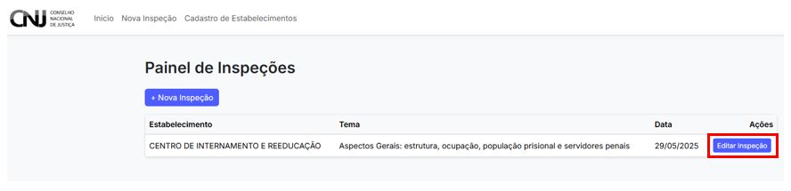
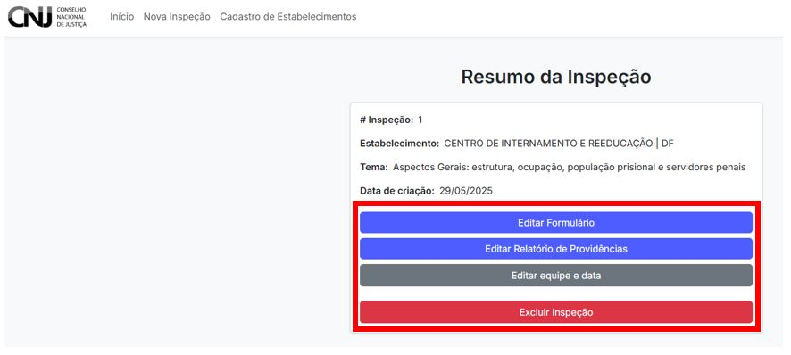
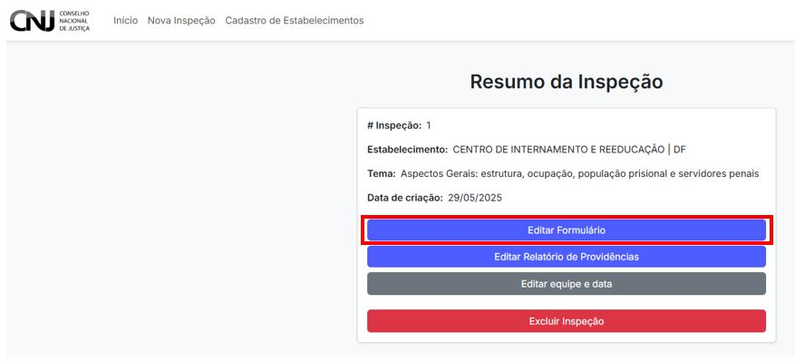
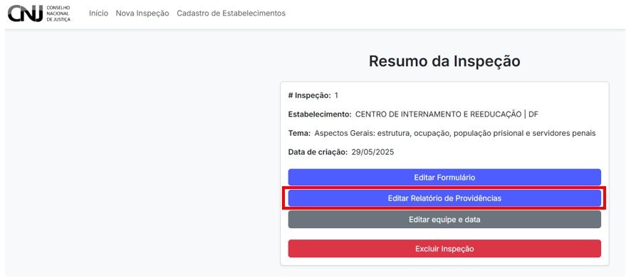
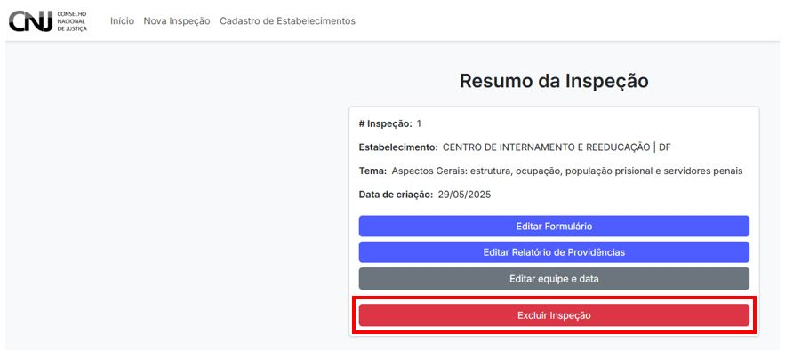

# 5. Editar Inspeção

Após criar uma inspeção no CNIEP, é possível editar os dados registrados acessando o painel principal e selecionando a opção **"Editar Inspeção"** na tabela.

---

## 5.1 Acessando a tela de edição

No **Painel de Inspeções**, clique no botão **"Editar Inspeção"** ao lado da linha correspondente à inspeção desejada.

---

## 5.2 Visão geral da tela de edição

Você será redirecionado para a tela de **Resumo da Inspeção**, que apresenta os dados básicos da inspeção e os botões para edição:

- Editar Formulário
- Editar Relatório de Providências
- Editar equipe e data
- Excluir Inspeção

---

## 5.3 Editar Formulário

Clique em **"Editar Formulário"** para retornar ao formulário principal da inspeção e ajustar respostas, completar campos ou revisar dados.

> ⚠️ O formulário só pode ser editado **antes da submissão final**. Após submetido, ele se torna bloqueado para alterações.

---

## 5.4 Editar Relatório de Providências

Se a inspeção já tiver sido finalizada e o relatório aberto, você poderá editar o conteúdo do **Relatório de Providências** clicando no botão correspondente.

---

## 5.5 Editar Equipe e Data

Para corrigir ou atualizar os dados sobre a equipe participante e o período da inspeção, utilize o botão **"Editar equipe e data"**.

---

## 5.6 Excluir Inspeção

Se a inspeção foi criada incorretamente ou se for um teste, você poderá removê-la clicando em **"Excluir Inspeção"**.  
> 🛑 Esta ação é irreversível!

---

> 🧠 **Atenção:** todas as edições devem ser feitas antes da submissão definitiva da inspeção ou do relatório. Após esse ponto, somente usuários autorizados poderão realizar alterações no sistema.
