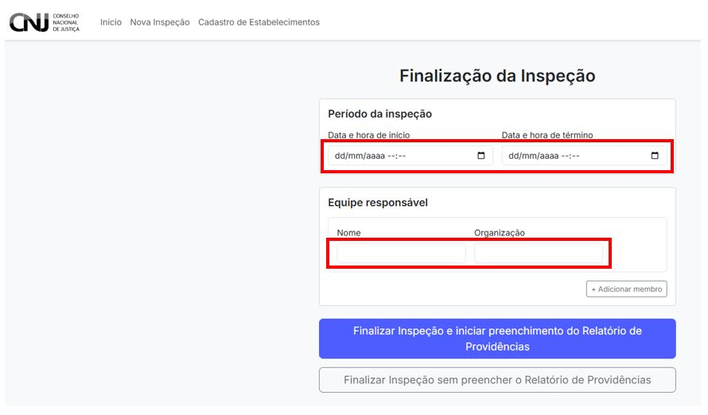
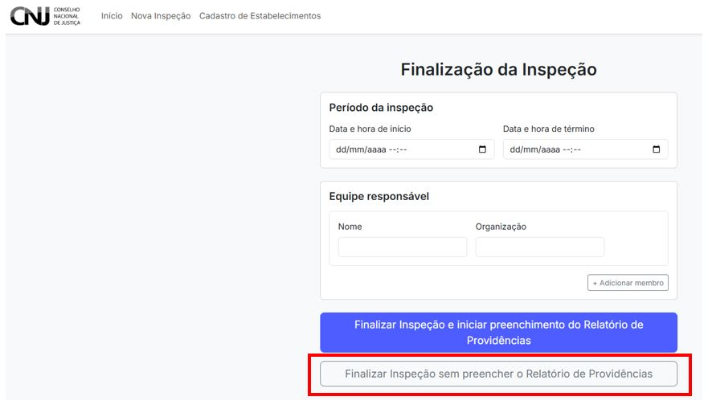

# 6. Finalização da Inspeção

Após o preenchimento do formulário, a etapa seguinte no fluxo da inspeção é sua **finalização oficial**. Essa etapa permite registrar o período de realização da inspeção, a equipe participante e, se for o caso, iniciar imediatamente o preenchimento do Relatório de Providências.

---

## 6.1 Registro de período e equipe

A primeira parte da tela de finalização exige o preenchimento dos dados básicos:

- **Data e hora de início da inspeção**
- **Data e hora de término**
- **Membros da equipe responsável**, com nome e organização

Esses dados devem refletir com precisão a execução em campo.

> 📌 É possível adicionar múltiplos membros à equipe clicando em **“+ Adicionar membro”**.

---

## 6.2 Finalizar com Relatório de Providências

Caso deseje já registrar as medidas corretivas sugeridas, clique no botão:

**"Finalizar Inspeção e iniciar preenchimento do Relatório de Providências"**

Esse caminho redirecionará o(a) usuário(a) diretamente à interface de preenchimento do relatório complementar.

---

## 6.3 Finalizar sem Relatório de Providências

Se a equipe optar por não preencher o relatório neste momento, pode utilizar a opção:

**"Finalizar Inspeção sem preencher o Relatório de Providências"**

Esse botão apenas encerrará a inspeção e retornará o(a) usuário(a) ao Painel de Inspeções.

> ⚠️ Essa decisão pode ser revertida posteriormente, caso seja necessário abrir o relatório mais tarde.

---

> 🧠 **Importante:** a finalização é uma etapa crítica. Certifique-se de revisar o formulário e confirmar os dados antes de encerrar a inspeção.
