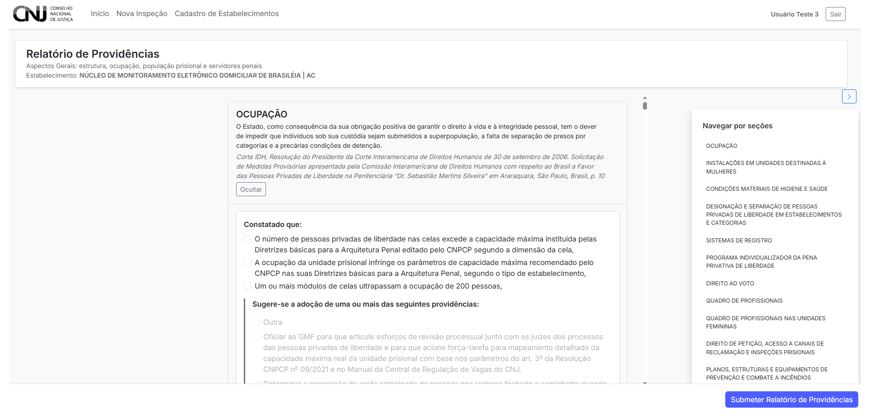
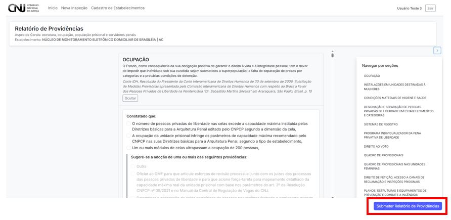

# 7. Relatório de Providências

O **Relatório de Providências** é um instrumento complementar ao formulário principal da inspeção. Ele permite registrar medidas corretivas, determinações judiciais e recomendações para enfrentamento das irregularidades constatadas durante a inspeção.

---

## 7.1 Estrutura do Relatório

O relatório segue o mesmo modelo visual do formulário temático, mas com características distintas:

- Cada seção aborda uma temática da inspeção.
- As respostas são predominantemente **discursivas** ou com marcação de **providências sugeridas**.
- Não há barra de progresso nem controle por fontes de verificação.

---

## 7.2 Submeter o Relatório

Após o preenchimento de todas as seções aplicáveis, clique no botão **“Submeter Relatório de Providências”** no canto inferior direito.

A submissão registrará o relatório e retornará o(a) usuário(a) ao **Painel de Inspeções**.

---

## Considerações importantes

- O relatório é de responsabilidade da autoridade judicial, mas pode ser redigido colaborativamente por membros da equipe.
- As providências sugeridas têm caráter **orientativo**, mas são fundamentais para alimentar a política judiciária penal.
- Após a submissão, o relatório **não poderá mais ser editado**, salvo por usuários com permissão especial.

---

> ⚠️ **Atenção:** revise todas as seções antes de submeter. O relatório é o documento oficial que orientará o CNJ e o sistema de justiça sobre as medidas a serem tomadas.
