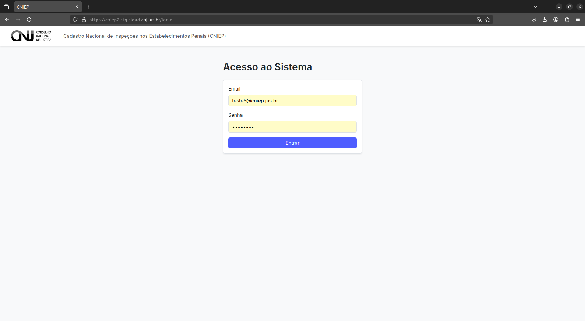

# Introdução ao CNIEP

O Cadastro Nacional de Inspeções nos Estabelecimentos Penais (CNIEP) é a ferramenta oficial de inspeções penais instituída pela Resolução CNJ nº 593/2024.

Este manual apresenta as instruções para uso da nova versão do sistema, vigente a partir de **14/05/2025**, em ambiente de testes. A versão está sendo disponibilizada no âmbito do programa **Pena Justa**, com o apoio da SENAPPEN, PNUD e Conselho Nacional de Justiça.

---

# Acesso ao Sistema

## 1.1 Endereço do Sistema

O sistema CNIEP está disponível, nesta versão de testes, no seguinte endereço:

```

[https://cniep2.stg.cloud.cnj.jus.br/](https://cniep2.stg.cloud.cnj.jus.br/)

```

As credenciais de acesso serão fornecidas por e-mail.

## 1.2 Tela de Login

A tela de login solicita:

- E-mail
- Senha
- Confirmação com botão “Entrar”



---

## 1.3 Avisos Importantes

- **Não atualize a página no navegador** (evite o botão de "refresh").
- **Dados não são salvos** automaticamente: qualquer navegação fora da página pode resultar em perda de informações.
- **Evite o upload de arquivos sensíveis** nesta versão de testes.
- Algumas **questões foram adaptadas** da versão em papel para a versão web. A ordem permanece, mas a numeração pode ter sido alterada.

---

> 💡 Em caso de dúvidas ou falhas técnicas, entre em contato com: `dadosfj@cnj.jus.br`

