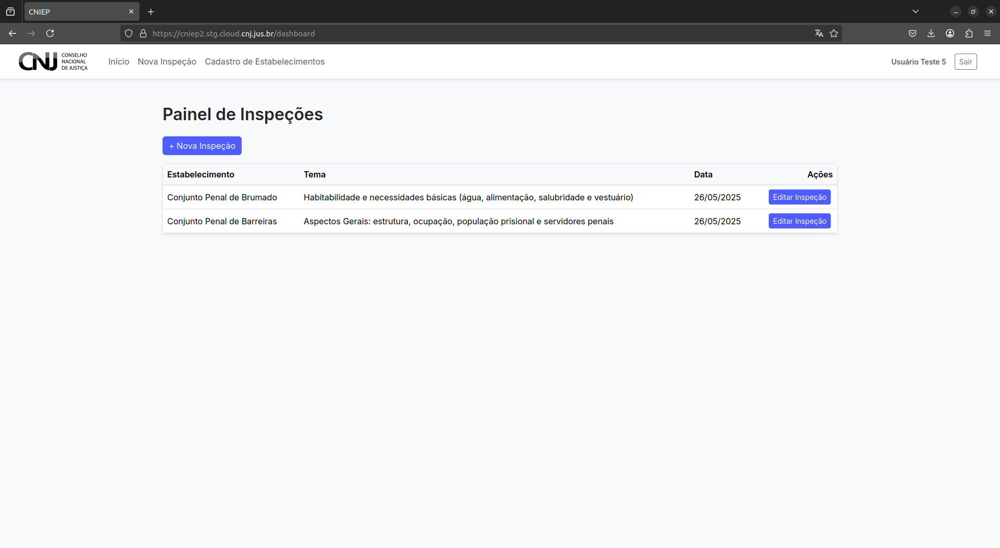
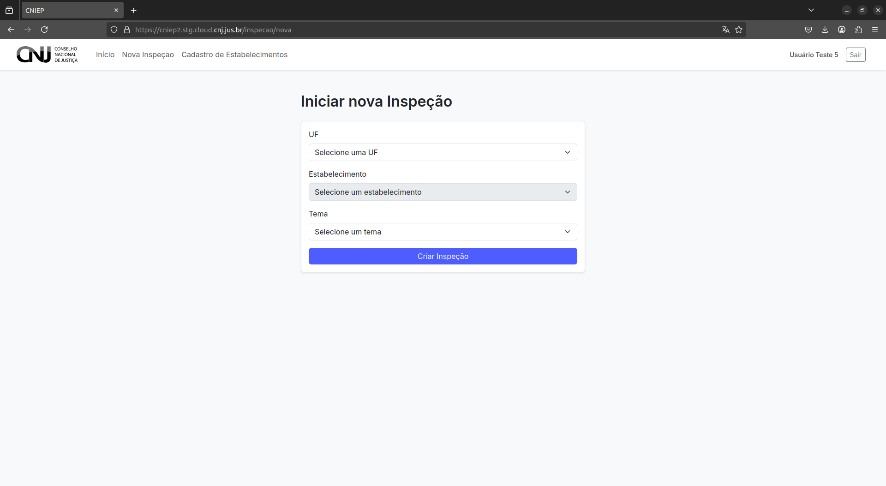

# Criando uma Nova Inspeção

Após realizar o login no sistema CNIEP, você poderá criar uma nova inspeção diretamente a partir do painel principal.

---

## 2.1 Acesso ao Painel de Inspeções

Na página inicial, localize o **Painel de Inspeções**. Para iniciar uma nova inspeção, há duas opções:

- Clique em **"Nova Inspeção"** na barra de navegação superior, **ou**
- Utilize o botão **"Nova Inspeção"** acima da tabela de inspeções existentes.

**Caminho:** Página Inicial → Painel de Inspeções → Nova Inspeção

---

## 2.2 Escolha de UF, Estabelecimento e Tema

Na tela de criação da inspeção, siga os seguintes passos:

1. **Selecione a Unidade da Federação (UF)** do estabelecimento.
2. Escolha o **estabelecimento penal** pelo nome.
3. Escolha o **tema da inspeção**. Exemplo:
   - *Aspectos Gerais: estrutura, ocupação, população prisional e servidores penais*
4. Clique no botão **"Criar Inspeção"**.

**Caminho completo:** UF → Nome do Estabelecimento → Tema → Criar Inspeção

---

> ⚠️ Certifique-se de selecionar corretamente a UF, o estabelecimento e o tema, pois essas informações não poderão ser alteradas após a criação da inspeção.
