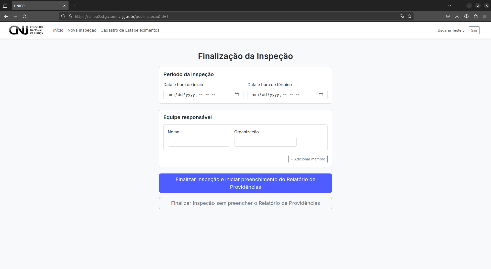
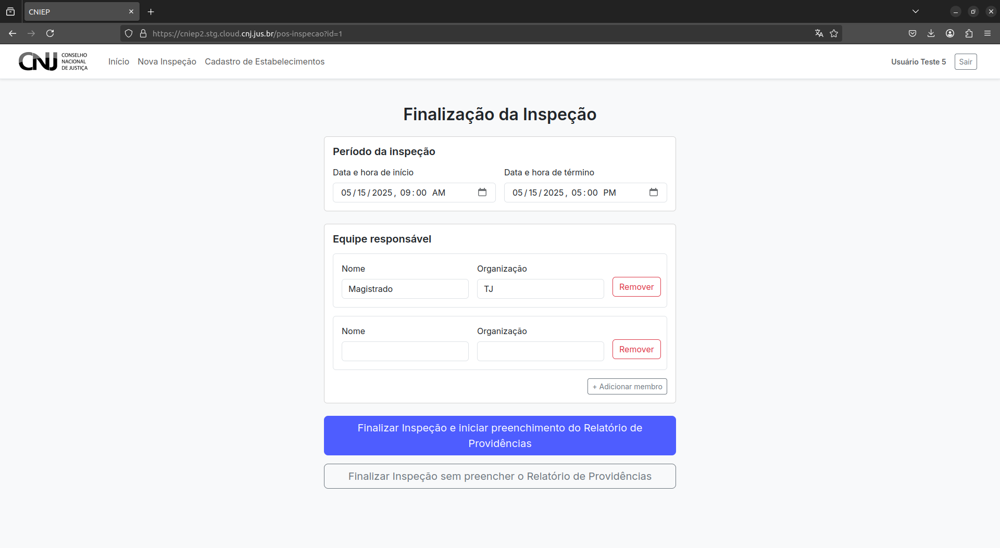

# Finalizando a Inspeção

Após o envio do formulário principal, o sistema redirecionará o(a) usuário(a) para a etapa final da inspeção. Nesta tela, serão registrados dados de encerramento e, opcionalmente, será iniciado o Relatório de Providências.

---

## 4.1 Registro da Data e Equipe de Inspeção

Preencha os seguintes campos:

- **Data e hora de início da inspeção**
- **Data e hora de término da inspeção**
- **Identificação da equipe**:
  - Insira os nomes de todas as pessoas que participaram da inspeção.

---

## 4.2 Opções de Finalização

Após inserir os dados da equipe, o sistema oferece duas opções:

1. **Finalizar a inspeção e iniciar o Relatório de Providências**
   - Encaminha diretamente para a tela de preenchimento do relatório complementar.

2. **Finalizar a inspeção e retornar ao Painel de Inspeções**
   - Finaliza a inspeção sem iniciar o relatório.

Escolha a opção desejada clicando no botão correspondente.

---

> ℹ️ A etapa de finalização garante o encerramento formal da inspeção e deve ser preenchida com atenção. Os dados inseridos serão utilizados para compor o histórico da atividade.
