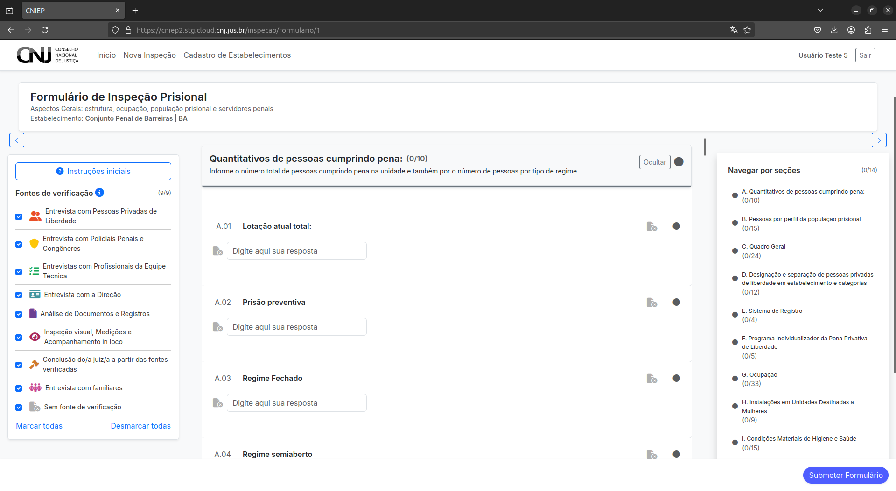
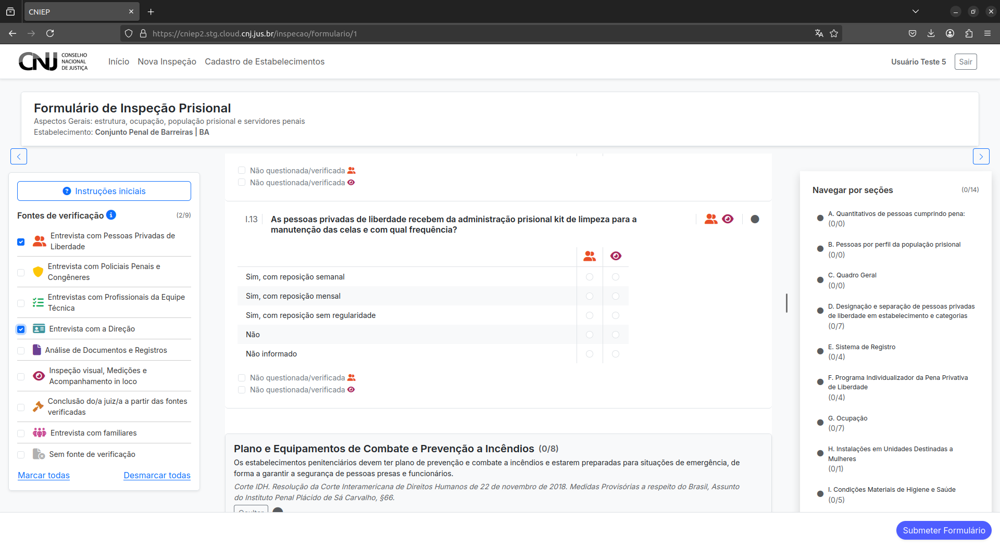

# Preenchendo o Formulário de Inspeção

O formulário eletrônico do CNIEP é o instrumento principal para o registro das informações obtidas durante a inspeção. Nesta etapa, o usuário irá navegar entre as seções, preencher as questões e utilizar os recursos auxiliares oferecidos pela interface.

---

## 3.1 Preenchimento das Questões

Durante o preenchimento:

- **Responda todas as perguntas** disponíveis no formulário.
- **Importante**: esta versão de testes **não salva automaticamente** as respostas.
  - Se a página for atualizada manualmente (refresh) ou se houver mudança de rota, as informações preenchidas **serão perdidas**.

---

## 3.2 Navegação Auxiliar

A interface do formulário foi desenhada para facilitar o preenchimento por meio de elementos visuais intuitivos:

- **Barra lateral esquerda**:
  - Permite a **seleção de fontes de verificação** que orientam as respostas.

- **Barra lateral direita**:
  - Exibe as **seções do formulário** e o **progresso de preenchimento** de cada uma.

- **Botões de controle**:
  - `Ocultar Seção`: permite recolher visualmente seções que não estão sendo preenchidas.
  - `Desmarcar como aplicável`: usado quando uma seção **não se aplica ao estabelecimento inspecionado**.

- **Instruções e explicações**:
  - Textos introdutórios ajudam a contextualizar cada seção e cada fonte de verificação.

---

## 3.3 Submissão do Formulário

Após preencher todas as seções:

1. Clique no botão **"Submeter Formulário"**.
2. Você será redirecionado(a) para a **página de finalização da inspeção**.

---

> ⚠️ Não se esqueça de revisar todas as seções antes da submissão. Após enviado, o formulário não poderá ser editado nesta versão de testes.
