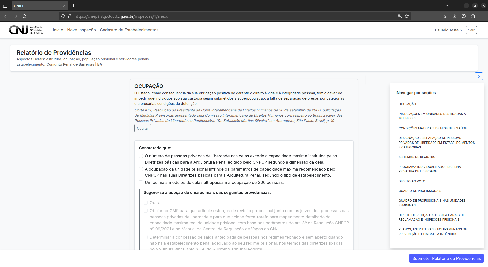

# Relatório de Providências

O Relatório de Providências é um instrumento complementar ao formulário da inspeção. Ele permite o registro de encaminhamentos, recomendações e medidas corretivas a serem adotadas em razão das constatações realizadas durante a visita.

---

## 5.1 Características do Relatório

- O relatório é composto por **um único tipo de questão**, de resposta aberta.
- **Não há fontes de verificação** vinculadas ao relatório.
- **Não há navegação por seções** nem barra de progresso.
- As respostas devem conter observações e medidas sugeridas de forma objetiva e direta.

> ⚖️ O Relatório de Providências é um instrumento **pós-inspeção**, voltado à autoridade judicial. Ele serve para registrar **ações a serem tomadas** frente às irregularidades ou fragilidades observadas no estabelecimento penal.

---

## 5.2 Preenchimento e Submissão

1. Preencha o campo com as providências sugeridas ou determinadas.
2. Ao concluir, clique no botão de **submissão do relatório**.
3. Você será automaticamente redirecionado(a) ao **Painel de Inspeções**.

---

> 💡 O preenchimento do Relatório de Providências é **opcional nesta etapa de testes**, mas altamente recomendado para consolidar a metodologia proposta pelo CNIEP.
