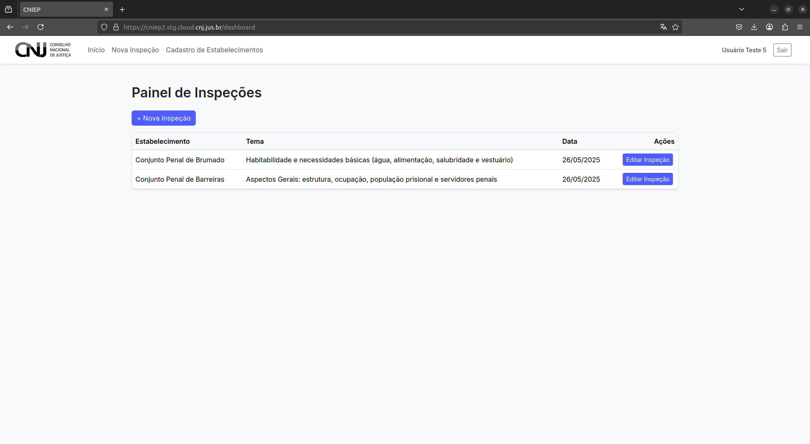

# Retorno ao Painel de Inspeções

Após a submissão do formulário e, se aplicável, do Relatório de Providências, o sistema redirecionará automaticamente o(a) usuário(a) ao **Painel de Inspeções**, onde é possível visualizar todas as inspeções realizadas, em andamento ou arquivadas.

---

## 6.1 Visualização de Inspeções

No Painel de Inspeções, você poderá:

- Consultar inspeções realizadas previamente.
- Acompanhar o status de inspeções em andamento.
- Iniciar novas inspeções, se necessário.

---

## 6.2 Encerramento da Sessão

Para encerrar a sessão com segurança:

1. Clique no botão **“Sair”**, localizado no canto superior direito da tela.
2. O sistema encerrará sua sessão e retornará à tela de login.

---

> 🔐 **Dica de segurança:** sempre encerre sua sessão ao finalizar o uso do sistema, especialmente se estiver utilizando computadores compartilhados.
